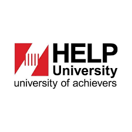

# Project Aid Hub

## Overview
---
The economic difficulties caused by the Covid-19 pandemic have affected many communities around the globe. In Malaysia, Datuk Michael Kang, president of SME Association of Malaysia predicted the same, saying that another full lockdown would cause 40% of SMEs to face financial difficulties and at least 2 million people unemployed ([New Straits Times, 2021](https://www.nst.com.my/news/nation/2021/05/691422/40-cent-smes-will-shut-down-if-there-full-scale-mco)) . Although a few platforms were introduced to deliver aid to the underprivilege, many of these platforms have high entry barrier for the aid applicants such as requiring constant internet connection and technology literacy. Hence, Project Aid Hub will have a highly accessible system for matching donors with aid applicants. The 3 main user segments are aid applicants, donors and organization representatives who will assist aid applicants when they face accessibility issues. 

 

Project Aid Hub will develop a responsive web application that will allow aid applicants facing accessibility issues to register into the system under an organization which plays a role as a broker between donors and the aid applicants. Since all tools used in the development of this project are free/open-source, the cost of this project will be effort and time along with hardware usage. 

 

Considering the urgency of the matter, the Aid Hub project is proposed to be finalized under a duration of 3 months by accommodating 4 hours per day towards the development of the system. 

## Team
---
**Arshia Gholami** / <gholami.arshia@outlook.com>

**Joel Cheah Ui Yi** / <gjoelcheah@gmail.com>

## References
---
New Straits Times. (2021, May 19). 40 per cent SMEs will shut down if there is full-scale MCO. NST Online. Retrieved February 1, 2022, from *<https://www.nst.com.my/news/nation/2021/05/691422/40-cent-smes-will-shut-down-if-there-full-scale-mco>*